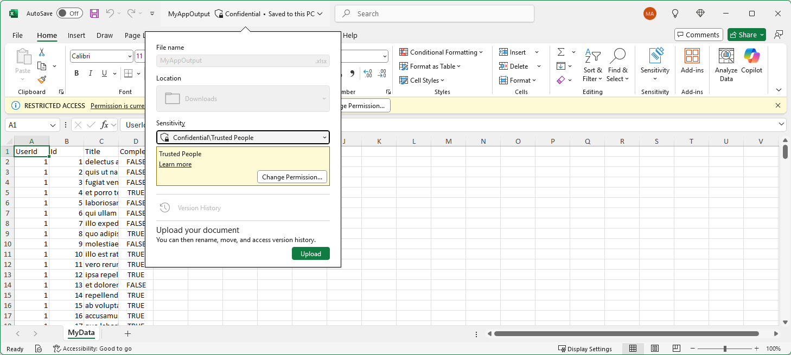

# Using MIP File SDK with ASP.NET to Label Files on Download




## Summary

This sample is intended to demonstrate the ease of integrating the MIP File SDK with custom applications, as well to demonstrate the experience one might find in a line-of-business or SaaS application. A user simply works as they've always worked, downloading some set of data to an Excel sheet. In this case, the file is labeled and protected on download, transparent to the end user. This allows organizations to allow their teams to work in familiar ways while still maintaining the security of sensitive information once extracted from controlled environments.

The ASP.NET web application displays a set of data in a GridView then allows the user to select an MIP label. After selecting a label, the user may click Download to get a copy of the data in Excel format. The downloaded file will have the selected MIP label applied.

Authentication in the sample is implemented via bearer token and an on-behalf-of flow, as detailed [here](https://github.com/Azure-Samples/active-directory-dotnet-native-aspnetcore-v2/tree/master/2.%20Web%20API%20now%20calls%20Microsoft%20Graph).

- Users authenticate to the ASP.NET web application
- The application stores their JSON web token.
- The service, using certificate based auth, obtains a new token, on behalf of the user, for use against the backend policy and protection services.

The sample has already implemented all of the UI and MIP SDK specific controls. While going through the sample, you'll perform the following tasks:

- Register the application in Azure Active Directory and configure certificate based authentication
- Update the appsettings.json authentication settings

At the end of the sample, you'll be able to run the web application, authenticate, view labels available to the user, and download an Excel file with the selected label applied.

## Getting Started

The application leverages an on-behalf-of authentication flow. The service will authenticate **as the user** to the backend services, meaning the labels and protection actions will be performed in the context of the user.

## Requirements

- An O365 E5 Tenant and global admin account
- Labels configured in [Office 365 Security and Compliance Center Portal](https://protection.office.com)

## Clone the Repository

1. Open a command prompt
2. Create a new folder `mkdir c:\samples`
3. Navigate to the new folder using `cd c:\samples`
4. Clone the repository by running `git clone https://github.com/Sak1012/MIP-FileSDK-ASPDotNet.git`
5. In explorer, navigate to *c:\samples\MIP-FileSDK-ASPDotNet* and open the MIP-FileSDK-ASPDotNet.sln in Visual Studio 2022.

## Add the NuGet Package

1. In Visual Studio, right click the MIP-FileSDK-ASPDotNet project.
2. Click **Manage NuGet Packages**
3. In the **Browse** tab, search for *Microsoft.InformationProtection.File* and install.

## Authentication

To enable the ASP.NET application to authenticate to Azure AD on behalf of the user, the following will be performed:

- Generate an X509 certificate
- Create an Application Registration in Azure AD
- Update the App Registration settings to allow access to the **Azure RMS** and **Microsoft Information Protection Sync Service** APIs
- Update the App Registration to accept certificate-based authentication

### App Registration

To allow clients to authenticate against the web application, as well as to enable the web application to connect on behalf of clients, a new application registration must be configured in the **Azure AD management portal**.

### Create an Azure AD App Registration

Authentication against the Azure AD tenant requires creating a native application registration. The client ID created in this step is used in a later step to generate an OAuth2 token.

> Skip this step if you've already created a registration for previous sample. You may continue to use that client ID.

1. Go to https://portal.azure.com and log in as a global admin.
> Your tenant may permit standard users to register applications. If you aren't a global admin, you can attempt these steps, but may need to work with a tenant administrator to have an application registered or be granted access to register applications.
2. Click Azure Entra ID, then **App Registrations** in the menu blade.
3. Click **New Registration**
4. Under *Supported account types* select **Accounts in this directory only**
5. Under *Redirect URI* select **Public client**
6. For *Redirect URI*, enter **mipsdk-auth-sample://authorize**   
  > Note: This can be anything you'd like.
8. Click **Register**

The registered app should now be displayed.

### Add API Permissions

1. Select **API permissions**.
2. Select **Add a permission**.
3. Select **Microsoft APIs**.
4. Select **Azure Rights Management Services**.
5. Select **Delegated Permissions** and then **user_impersonation**.
6. Select **Add permissions**.
7. Again, Select **Add a permission**.
8. Select **APIs my organization uses**.
9. In the search box, type **Microsoft Information Protection Sync Service** then select the service.
10. Select **Delegated permissions**.
11. Check **UnifiedPolicy.User.Read**.
12. Select **Add permissions**.
13. In the **API permissions** blade, Select **Grant admin consent for <Your Tenant>** and confirm.

### Set Redirect URI and Implicit Grant

1. Select **Authentication**.
2. Select **Add a platform**.
3. Select **Web**
4. Enter **https://localhost:44376/**
5. Also Enter **https://localhost:44376/signin-oidc** as a redirect URI.
  > This is the default URL for the ASP.NET application. If you change the port or use a different URL, update this value accordingly.
6. Select **configure**. 
7. Check **ID Tokens** under the *Implicit grant* section. 
8. Save changes.

### Generate a client secret

If you'd prefer to use certificate based auth, skip ahead to [Generate a client certificate](#Generate-a-client-certificate).

1. In the Azure AD application regisration menu, find the application you registered.
2. Select **Certificates and secrets**.
3. Click **New client secret**.
4. For the description, enter "MIP SDK Test App".
5. Select **In 1 year** for expiration
  > This can be 1 year, 2 years, or never.
6. Click **Add**.

The secret will be displayed in the portal. **Copy the secret now, as it will disappear after page refresh.**

  > Storing client secrets in plaintext isn't a best practice

### Generate a client certificate

This step generates a self-signed certificate, writes the thumbprint to the console, then exports the certificate to a cert file. If you used a [client secret](#Generate-a-client-secret), skip ahead to [update application configuration settings](#Update-application-configuration-settings).

Run the following PowerShell script:

```powershell
mkdir c:\temp
cd c:\temp

#Generate the certificate
$cert = New-SelfSignedCertificate -Subject "CN=MipSdkFileApiDotNet" -CertStoreLocation "Cert:\CurrentUser\My"  -KeyExportPolicy Exportable -KeySpec Signature
$cert.Thumbprint
$certFile = (Get-ChildItem -Path Cert:\CurrentUser\my\$($cert.thumbprint))
Export-Certificate -cert $cert -FilePath cba.cer -Type:CERT

# take the CER file and upload to AAD App Registration portal
```

### Import the certificate to the application registration

In this step, the public certificate generated in the previous section will be imported to the application registration.

1. In the Azure AD application regisration menu, find the application you registered.
2. Select **Certificates and secrets**
3. Click **Upload certificate**
4. Browse to the CER file generated in the previous section, then click **Add**

The certificate will appear in the list, displaying the thumbprint and validity period.

### Install Additional NuGet Packages

The required NuGet packages must be restored. To restore the packages:

1. Right-click the **MipSdkFileApiDotNet** project
2. Go to **Manage NuGet Packages**
3. A yellow banner will indicate that NuGet packages are missing. Click **Restore** to fetch the missing packages.

### Update appsettings.json

The appsettings.json file must be updated to store several identity and application-specific settings. Several of these settings should already be populated if you created the project from scratch and configured authentication in the wizard.

#### Update/Add appSettings

1. In the MipSdkFileApiDotNet project, open the **appsettings.json** file.
2. Find `<!-- TODO: Update ida: settings below for your tenant -->`
3. Update the values in bold below with settings from the Azure AD tenant.
4. Use the table below to find the value for each setting and update the appsettings.json.

> Ensure that the certificate name matches the name [used above](#create-self-signed-certificate)

| Key                           | Value or Value Location                                                                                                      |
| ----------------------------- | ---------------------------------------------------------------------------------------------------------------------------- |
| **ClientId**              | Azure AD App Registration Portal - [Detailed here](#app-registration): Copy the Application(Client) ID                               |
| **Instance**           | https://login.microsoftonline.com                                                                                            |
| **TenantId**              | [AAD Properties Blade](https://portal.azure.com/#blade/Microsoft_AAD_IAM/ActiveDirectoryMenuBlade/Properties) - Directory ID |
| **PostLogoutRedirectUri** | Set to site root (https://localhost:44376 in sample), and set in **App Registration->Settings->Logout URL**                  |
| **Thumbprint**            | Thumbprint of the certificate generated above.                                                                               |
| **MipDataPath**                   | App_Data\mip_data                                                                                                            |
| **DataEndpoint**              | Any public web service to load data for GridView.                                                                            |

#### Update IdentityConfiguration

To save the bootstrap context token for the on behalf of authentication flow, the setting must be enabled in `identityConfiguration`.

Skipping this step will result in the on-behalf-of flow failing in later steps.

1. In appsettings.json find `saveBootstrapContext`
2. Ensure that the value is set to **true**.

```xml
<system.identityModel>
    <identityConfiguration saveBootstrapContext="true"/>
</system.identityModel>
```

3. Save the changes to appsettings.json.

**At this point the application should build and run. Read on to learn more about the details of the sample.** [Jump here](#build) to see the test steps.

### The Auth Delegate

The MIP SDK exposes a class called `Microsoft.InformationProtection.AuthDelegate`. This is an abstract class, intended to be implemented by the application developer to leverage their desired authentication libraries. The MIP SDK doesn't implement auth itself, rather it enables the developer to implement any auth library they wish.

To implement the authentication delegate, we create a new class, inheriting `Microsoft.InformationProtection.IAuthDelegate` and implement the `AcquireToken` function.

The sample leverages ADAL as part of the ASP.NET application. Specifically, the service will use certificate based authentication to perform operations on behalf of the user against the MIP endpoints. **Certificate based authentication is required to use the MIP policy endpoints.**

1. Open **AuthDelegateImplementation.cs**
2. Find `public string AcquireToken()`
3. Review the code path for obtaining an access token on behalf of a user.

The `IAuthDelegate` is passed to the `IFileProfile` at creation. When adding an engine for a specific user, `IAuthDelegate.AcquireToken()` is called, and should accept `Identity`, the authority URL, and the resource URL, in string format, as parameters. The API will pass this values to the method.

> The `IAuthDelegate` provides flexibility in that it allows the developer to implement **any OAuth2 token acquisition library** to meet their needs. In this sample the Microsoft Authentication Library (MSAL) is used, but 3rd party libraries, or even hard-coding a token, would work as far as the MIP SDK is concerned. It only expects that it will pass in some parameters to `AcquireToken` and get back an OAuth2 token in string format. The token issuer and audience should match the authority and resource provided as input.

## Custom Objects

This sample leverages two custom classes to read and parse data from the JSON endpoint and from the MIP SDK.

- `Models.Label`: A custom object to store basic information about the MIP Label. Used to populate the treeview. 
- `Models.CustomClass`: An intentionally generic name as this class stores whatever data is pulled from the service defined as **DataEndpoint** in appsettings.json. If a new endpoint or data source is used, this class must be updated to accommodate that new data source.

This class is used in Index.cshtml when populating the "data" object.

## Implement the File API Class

The MIP SDK File API functionality is implemented in a class called `FileApi`. This class encapsulates all SDK operations related to files, providing a clean and reusable interface across the application.

The `FileApi` class implements the following key methods and functionality:

| Method                          | Purpose                                                                                      |
| ------------------------------- | -------------------------------------------------------------------------------------------- |
| `InitializeAsync()`             | Initializes the MIP SDK, application context, creates profile and file engine.               |
| `CreateFileHandler()` (private) | Returns an `IFileHandler` for a file or stream, based on whether `Stream` input is provided. |
| `ApplyLabel()`                  | Applies a MIP label and (optionally) protection to a file/stream and writes it to output.    |
| `ListAllLabels()`               | Retrieves all available sensitivity labels and returns them as `List<Models.Label>`.         |


### Initialization – `InitializeAsync()`

Instead of using the constructor to initialize the SDK, the setup is now handled asynchronously in the `InitializeAsync()` method. This method:

* Sets up the `ApplicationInfo` using values from configuration.
* Initializes the MIP SDK and creates a `MipContext`.
* Creates a `FileProfile` using `LoadFileProfileAsync()`.
* Gets the signed-in user from the HTTP context.
* Uses an `AuthDelegateImplementation` that caches the user claims.
* Creates a `FileEngine` via `AddEngineAsync()`.

This structure ensures async initialization of all required SDK components before usage.


### CreateFileHandler()

The `CreateFileHandler()` method (now private) creates an `IFileHandler` using a stream if available, or falls back to a file path. It's invoked internally from `ApplyLabel()` to abstract away handler creation logic.

```csharp
return stream != null
    ? await _fileEngine.CreateFileHandlerAsync(stream, fileName, true)
    : await _fileEngine.CreateFileHandlerAsync(fileName, fileName, true);
```

### ApplyLabel()

The `ApplyLabel()` method has been significantly updated to support conditional application of protection.

This method:

* Accepts `inputStream`, `outputStream`, `fileName`, `labelId`, `justificationMessage`, and a `ProtectionOptions` object.
* Constructs `LabelingOptions` with justification, assignment method, and extended properties.
* If `ProtectionOptions.Emails` is empty or null, only the label is applied.
* If protection is required, it builds a `UserRights` list and a `ProtectionDescriptor`, then applies protection using `SetProtection()`, followed by `SetLabel()`.

```csharp
if (!protect) {
    handler.SetLabel(label, labelingOptions, new ProtectionSettings());
} else {
    var protectionDescriptor = new ProtectionDescriptor(userRightsList);
    handler.SetProtection(protectionDescriptor, new ProtectionSettings());
    handler.SetLabel(label, labelingOptions, new ProtectionSettings());
}
```

Once done, `CommitAsync()` writes the results to the output stream. If successful, an audit event is triggered using `NotifyCommitSuccessful()`.

### ListAllLabels()

This method uses `_fileEngine.SensitivityLabels` to retrieve all available labels, including children. The results are transformed into a list of `Models.Label` for use in the UI or elsewhere in the application.

This version also includes extensive debug logging for diagnostic purposes.

## Review the OnClick Handler for the Download Button

When the user selects a label and clicks the download button, the application exports the data displayed in the UI to an Excel spreadsheet. The selected MIP label (and protection, if configured) is then applied to the file before download.

This functionality is implemented in the `OnPostDownload()` method in the Razor Page backend.

1. Open **Index.cshtml.cs**
2. Find **OnPostDownload()**
3. Review the implementation.

### Key Flow:

* The method begins by checking if the user is authenticated and attempts to acquire a token via `_tokenAcquisition.GetAccessTokenForUserAsync()` (this may prompt for consent).
* The `FileApi` is initialized asynchronously using `await _fileApi.InitializeAsync()`.
* The Excel data is generated from the in-memory collection `Data` using a predefined template (`Template.xlsx`).
* The user-selected label ID (`SelectedLabelId`) and protection options (parsed from a form input) are passed into `ApplyLabel()`.

```csharp
var result = _fileApi.ApplyLabel(
    excelStream,         // Input stream with Excel data
    outputStream,        // Output stream for labeled file
    fileName,            // e.g., "MyAppOutput.xlsx"
    SelectedLabelId,     // Label selected in UI
    "",                  // Justification message (optional)
    protectionOptions    // Includes emails and rights
);
```

* If the selected label requires additional protection details, and they’re not provided, an `AdhocProtectionRequiredException` is thrown. This is caught and handled by:

  * Setting `ViewData["NeedsAdditionalInfo"] = true` so the frontend can prompt the user for more input (e.g., user emails).
  * Returning the page with validation errors, rather than proceeding with download.

* If the label is successfully applied, the resulting `MemoryStream` is returned as a downloadable Excel file response.

```csharp
return File(
    fileContents: outputStream.ToArray(),
    contentType: "application/vnd.openxmlformats-officedocument.spreadsheetml.sheet",
    fileDownloadName: fileName
);
```
## Build

At this stage, it should be possible to build and run the application. When prompted to authenticate, provide user credentials for a user account in the configured tenant. **Press F5 to build and run!**

Test the application by:

- Clicking a label to apply
- Clicking the download button
- Opening the Excel file and observe that the file is labeled.
  - The [AIP Unified Labeling Preview Client](https://www.microsoft.com/en-us/download/details.aspx?id=57440) is required to display labels natively.
  - To see the labels without preview client, click **File->Info->Properties->Advanced Properties->Custom**
  - If the label applies protection, the yellow protection banner will also be displayed.

## Troubleshooting

## Sources/Attribution/License/3rd Party Code

Unless otherwise noted, all content is licensed under MIT license.

Authentication code modeled/copied primarily from the [Active Directory DotNet WebApi On Behalf Of](https://github.com/Azure-Samples/active-directory-dotnet-webapi-onbehalfof) sample.

Excel output generated by [EPPlus](https://www.nuget.org/packages/EPPlus).

JSON de/serialization provided by [Json.NET](https://www.nuget.org/packages/Newtonsoft.Json/)
